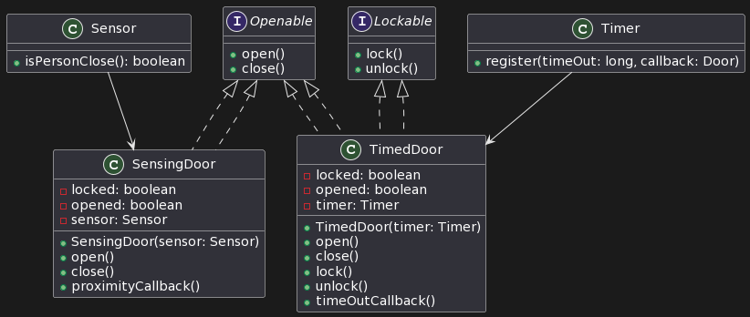

# TP1 Report: The SOLID principles

## Words from the authors

This report is about the **SOLID Lab** problem in the  [LAB1](https://github.com/INSATunisia/SOLID).

The solution provided in this report are not the only one, but they are the one we think are the best with our knowledge and our understanding of the **SOLID principles**.

Feel free to contact us if you have better solutions to dicsuss together or if you have any questions. :smile:

## 1.Single Responsibility Principle **SRP**

### 1.1 Problem

The `CarManager` class have access to the data base to get the car information or to add cars and in the same time has the responsibility to do too many operations .

The isssue here is if the car class scales the functionalities will be more and more complex and the `CarManager` class will be more and more complex and will have too many responsibilities.

In **SRP** we need to have a class that has only one responsibility and one reason to change.

### 1.2 Solution

For that we proposed this [solution](./SRP/Solution/car.wsd) :

* A [Car](./SRP/Solution/Car.java) class
* A [CarManager](./SRP/Solution/CarManager.java) class that communicates with the database and has the responsibility to add cars and get cars information
* A [BestCarProvider](./SRP/Solution/BestCarProvider.java) class that has the responsibility to get the best car from the database
* A [CarNameProvider](./SRP/Solution/CarNameProvider.java) class that has the responsibility to get the car name from the database

Now according to our solution :

* The `CarManager` class has only one responsibility which is to add cars and get cars information : If we want to extand the functionalities to not only *add* and *get* but also *delete* and *update* a single database manager will be enough.
* Each of the services has only one responsibility and can be extended easily without affecting the other services.
* When scaling and adding other services the new microservices will be independent to and will only communicate with the database manager.

## 2.Open Closed Principle **OCP**

### 2.1 Problem

The `ResourceAllocator` class has a method `handleResource` that has a switch case that checks the type of the resource and free or allocate it, it also has many methods for each type of resource : this will make the code more long to build and maintain cause if we have new functionalities we will need to add new methods and new cases to the switch case.

### 2.2 Solution

For that we proposed this [solution](./OCP/Solution/resource.wsd) :

* A [Resource](./OCP/Solution/Resource.java) interface that has the `markResourceFree` , `markResourceBusy` and `findFreeRseource` methods
* A [Slot](./OCP/Solution/Slot.java) class that implements the `Resource` interface and has the `markResourceFree` , `markResourceBusy` and `findFreeRseource` methods
* A [Time](./OCP/Solution/Time.java) class that implements the `Resource` interface and has the `markResourceFree` , `markResourceBusy` and `findFreeRseource` methods
* A [ResourceAllocator](./OCP/Solution/ResourceAllocator.java) class that has the handels the resources with `getResourceID`,`allocate` and `free` methods

Now according to our solution :

* The `ResourceAllocator` class has only one responsibility which is to allocate and free resources : If we want to extand the functionalities to not only *allocate* and *free* .
* If the resouce has a new type we will only need to add a new class that implements the `Resource` interface and add the new type to the `ResourceAllocator` class.
* If the resouce has a new method we will only need to add a new method to the `Resource` interface and implement it in the our resource types in custom way.

## 3.Liskov Substitution Principle **LSP**

### 3.1 Problem

The `ElectronicDuck` extends the `Duck` class and overrides the `quack` and `swim` methods directly : one we decided to remove the methods from the `Duck` class or the class itself ( maybe one day there will never be ducks only electronic duck, let's hope this will never happens xD) the code will break cause the `ElectronicDuck` class will not have the class to extend from and the methods to override.

This clearly violates the **LSP** principle which states that the child class should be able to replace the parent class without affecting the functionality of the program. (The definition of LSP is a bit more complex but this what we understood from it)

### 3.2 Solution

For that we proposed this [solution](./LSP/Solution/duck.wsd) :

* A [Duck](./LSP/Solution/Duck.java) interface that has the `quack` and `swim` methods
* A [ElectronicDuck](./LSP/Solution/ElectronicDuck.java) class that implements the `Duck` interface and has the `quack` and `swim` methods and the new custom `turnOn` and `turnOff` methods
* A [RegularDuck](./LSP/Solution/RegularDuck.java) class that implements the `Duck` interface and has the `quack` and `swim` methods
* A [Manager](./LSP/Solution/Pool.java) class that runs the behaviour of the ducks
* A [Pool](./LSP/Solution/Pool.java) class that serves as the `main` class and runs the behaviour of the ducks

Now according to our solution :
* If new types of ducks are added we will only need to add a new class that implements the `Duck` interface .
* If new general behaviours are added we will only need to add a new method to the `Duck` interface and implement it in a custom way in the new duck types.
* If new custom behaviours are added we will only need to add a new method to the custom duck types.
* If we want to remove the `RegularDuck` class the changes will not affect the `ElectronicDuck` class. (or the new duck variants xD)

## 4.Interface Segregation Principle **ISP**

### 4.1 Problem

The ISP states that no client should be forced to depend on methods it does not use. (The second easiest definition,the easiest is clearly the one of the **SRP** principle xD).

The `Door` interface has methods that are not relevant to all type of doors so we have to implement methods that we don't need to not break our code. ( `proximityCallBack` and `timeOutCallBack` methods )

Also `TimedDoor` use all the `Door` methods meanwhile `SensingDoor` only `open` and `close` methods from the `Door` interface but they have to implement the full interface to not break the code.

### 4.2 Solution

For that we proposed this [solution](./ISP/Solution/door.wsd) :

* A [Openable](./ISP/Solution/Openable.java) interface that has the `open` and `close` methods
* A [Lockable](./ISP/Solution/Lockable.java) interface that has the `lock` and `unlock` methods
* A [Sensor](./ISP/Solution/Sensor.java) class that add additional functionality so the `SensingDoor` can use it.
* A [Timer](./ISP/Solution/Timer.java) class that add additional functionality so the `TimedDoor` can use it.
* A [SensingDoor](./ISP/Solution/SensingDoor.java) class that implements the `Openable` interface and has the `open` and `close` methods and uses the `Sensor` class.
* A [TimedDoor](./ISP/Solution/TimedDoor.java) class that implements the `Openable` and `Lockable` interfaces and uses the `Timer` class.

Now according to our solution :

* The `SensingDoor` will not have to implement the `lock` and `unlock` methods that are not used.
* The `SensingDoor` and `TimedDoor` will not have to implement the `timeOutCallBack` and `proximityCallBack` methods that are not used respectively.

### 4.3 Solution 2

Another [solution](./ISP/Solution2/door.wsd) for this problem :

* This solution extract the `proximityCallBack` and `timeOutCallBack` methods to a new interfaces called `proximityCallBack` and `timeOutCallBack` respectively.
* Personally we prefer the first solution cause it's more simple and has less coupling (we think so xD) cause the second solution has more interfaces , the classes have to implement more interfaces and when scaling ; the code build will be more resource consuming (cause we will create new interface for each new method and the class will have to implement more) . 

## 5.Dependency Inversion Principle **DIP**

### 5.1 Problem

After understanding the **DIP** principle which states that high-level modules should not depend on low-level modules, both should depend on abstractions. (We hope we got it right xD), the `EncodingModule` class violates this principle as it depends on concrete implementations such as `FileReader`, `FileWriter`, `URL`,`InputStream` and `MyDatabase`.

### 5.2 Solution

For that we proposed this [solution](./DIP/Solution/encoding.wsd) :

* A [DataStorage](./DIP/Solution/DataStorage.java) interface that has the `read` and `write` methods
* A [FileDataStorage](./DIP/Solution/FileDataStorage.java) class that implements the `DataStorage` interface and has the `read` and `write` methods
* A [NetworkDataStorage](./DIP/Solution/NetworkDataStorage.java) class that implements the `DataStorage` interface and has the `read` and `write` methods
* A [EncodingModule](./DIP/Solution/EncodingModule.java) high-level class that depends on the `DataStorage` interface and has the `encode` and `decode` methods
* A [EncodingModuleClient](./DIP/Solution/EncodingModuleClient.java) class that serves as the `main` class and runs the behaviour of the `EncodingModule` class

Now according to our solution :

* The `EncodingModule` class,which is the high-level class responsible for encoding operations, no longer directly depends on concrete implementations but instead depends on abstractions (the `DataStorage` interface).
* The `EncodingModuleClient` serves as the `main` class and the entry point of the program.

## 6.Conclusion

In this lab we learned about the **SOLID** principles and how to apply them in our code to make it more maintainable and extensible.

---

### Authors
- Oussema Jaouadi
- Hadil Bouhamed

### Subject
- Reactive Architectures and Microservices

### Supervised by
- Mme. Lilia Sfaxi

---
